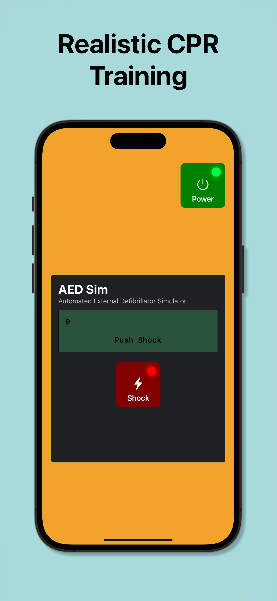
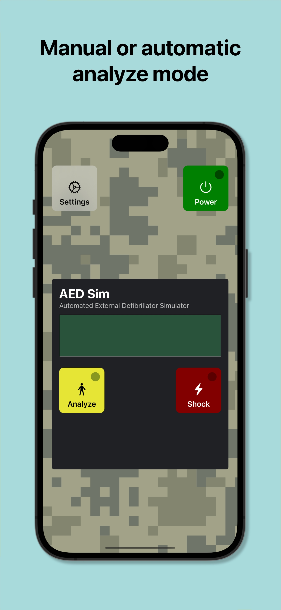
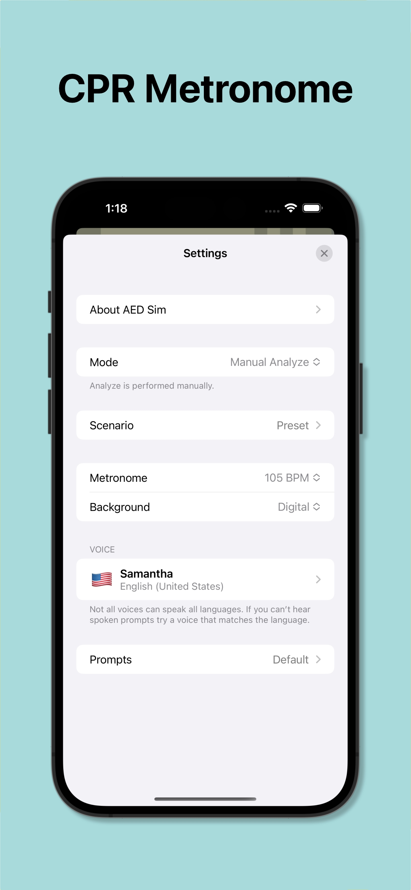
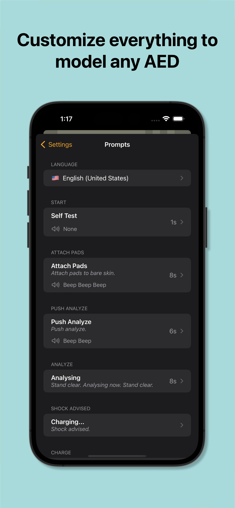
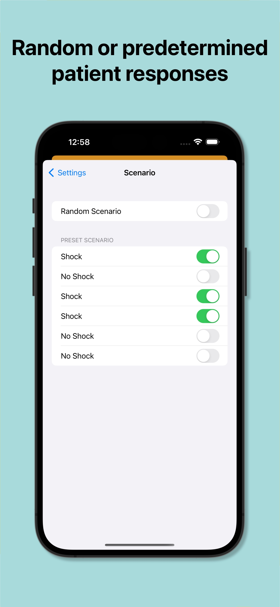

Realistic AED simulator for CPR training. Built for iPhone and iPad. No ads. No tracking.

<video style="display:inline-block; width: 300px" controls alt="Accurate voice & sound effects">
  <source src="screenshots/6.mov#t=0.001" type="video/mp4">
  Your browser does not support the video tag.
 </video>

## Features

- Authentic simulation of an AED (Automatic External Defibrillator). Realistic voice prompts, button clicks, sound effects, graphics, animations and flashing lights.
- LED displaying instructions, number of shocks, and CPR countdown timer.
  CPR metronome provides beats at 100, 105, or 110 BPM (beats per minute). This ensures CPR compressions at the correct frequency.
- Scenario editor allows for custom or random scenarios.
- All prompts, messages, timing, and voices are customizable. You can change any message or voice prompt to match any AED.
- Allows for user provided backgrounds, sound effects, and even metronomes. Drop an MP3 of Staying Alive into the Metronomes directory to do compressions to the Bee Gees.
- Adheres to 2020 CPR Guidelines.
- Universal app supports iPad.
- Great price.

## Details

An AED is a device used to provide a shock of electricity to somebody in cardiac arrest (having a heart attack). Defibrillation is the definitive treatment. Knowing how to use an AED is an important skill for firefighters, EMTs, paramedics, nurses, doctors and general public.

AED Sim gives people a chance to see, hear and interact with an AED. If you have ever been curious about how one operates now is your chance.

The built-in scenario editor lets you create a custom scenario or it can generate a random scenario for you. Combine an iPhone or iPad and AED Sim and youʼve got an inexpensive realistic training environment for practicing CPR. No costly AED trainers needed.

Designed and built by a former Canadian paramedic with 20 years of software development experience.

